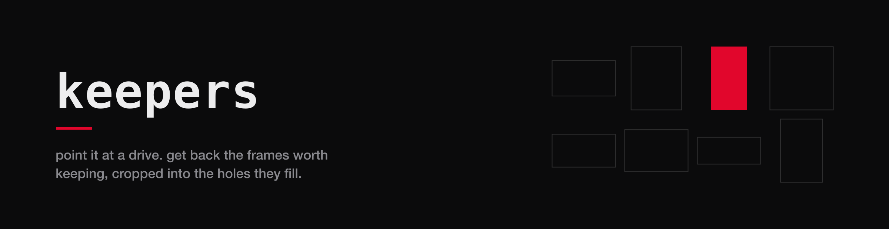
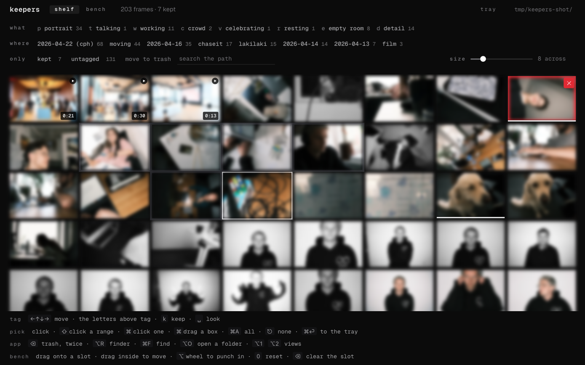
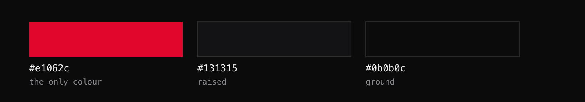

# keepers



<!-- to swap the banner for a real frame or a loop later, drop it in
     docs/media/ and point the src at it. keep it wide, 4/1, and dark. -->

<!-- one badge is red and the rest are the ground, for the same reason one
     thing on the shelf is red: the accent marks the claim that matters, and
     a row of five red badges marks nothing. -->


a shoot comes back as 1,768 frames and a website has sixteen holes. every
hour between those two numbers goes on scrolling a finder window at 200px a
thumbnail, and that is the hour this takes back.

```
keepers ~/Archive
```

scans, thumbnails, opens a browser. **mac only.** nothing is uploaded, nothing
leaves the machine, and **the originals are never written to.**

<!-- media slot, the shelf. a screenshot of the grid with a few frames in a
     tray reads better than any paragraph here.
      -->

## at a glance

| | |
|---|---|
| what it is | a culling and cropping bench for a photo and video archive |
| runs on | macos, node 20 or newer |
| dependencies | one, `sharp` |
| network | none. it binds to loopback and talks to nothing |
| who tags the photographs | the coding agent you already pay for |
| what it writes | one folder, `<archive>/.keepers/`, and nothing else |
| licence | mit |

## no api key, and none wanted

keepers does not ship a vision model and does not ask for a key. it writes
**contact sheets built for a machine to read**, sized so a face survives the
cell, and it takes the answer back as one line of letters per sheet.

```
keepers sheets ~/Archive
```

hand the sheets to claude code, or cursor, or whatever agent is already open,
together with [AGENTS.md](AGENTS.md), which is the brief. it reads them and
writes a file. then:

```
keepers tag ~/Archive tags.txt
```

a sheet whose letter count disagrees with its cell count is **refused whole**,
not applied. one miscounted sheet silently shifting every later tag onto the
wrong photograph is the failure that would make the whole thing worthless.

## drag a folder in

drop a folder from finder anywhere on the window and keepers opens it. no
command, no path typed.

it is worth knowing what happens under that, because it is the one place a
browser cannot do the obvious thing. **a page is never told the absolute path
of anything dragged in from outside.** it gets the name, and for a folder it
may list what sits directly inside, and that is the end of it. so keepers
recovers the path in three steps and each one is a real way in:

1. the drag's own url flavour. some sources write a `file://` url and some
   write nothing, so it is always worth asking and never worth relying on.
2. spotlight. the folder's name plus a couple of dozen of the names inside it
   is enough to tell one folder called `2026` from the other four on the
   disk. one match opens, several are offered, none falls through to step 3.
3. the real finder folder dialog.

nothing in it ever says the drop failed when what happened is that the
browser withheld the path. those are two different sentences and only one of
them is ever true.

## the shelf

every frame, filterable by what is in it and by where it came from.

keyboard first, because that is the only way it actually gets done: arrows
move, a letter tags, space keeps, the cursor advances on its own. a thousand
frames is twenty minutes through the home row and an afternoon through a
mouse.

- untagged frames sit under a scrim, so what is left to do is visible from
  across the room
- click opens a preview at the picture's real size, not a full screen takeover
- `r` reveals the file in finder, selected
- cmd click drops a frame into a tray

## the bench

the bench asks one question: **does this photograph survive that shape.**

drag a frame onto a slot, drag inside it to move the picture, alt wheel to
punch in. every slot is drawn at its true proportions.

the shapes nobody gets to choose are built in, so the bench is full on the
first run with no config at all:

| | |
|---|---|
| instagram | 4/5 post, 1/1 square |
| reel, story, tiktok, shorts | 9/16 |
| x, in feed | 16/9 |
| youtube thumbnail | 16/9 at 1280, judged at a sixth of that |
| link preview | 1.91/1, which is also linkedin and slack and imessage |
| pinterest | 2/3 |
| web | 16/9, 3/2, 4/3, 21/9 letterbox, 3/1 banner, 2/3 column, 1/2 skyscraper |

then your own holes, in `keepers.config.json`:

```json
{
  "slots": [
    { "id": "hero",    "aspect": "16/9", "width": 2400 },
    { "id": "about-1", "aspect": "3/2",  "width": 1200,
      "note": "the room rather than a wall of faces" }
  ]
}
```

`keepers export` writes the cut file plus a `placement.json` for every slot
that has something in it.

## trays

a tray is the pile you build while you browse. click a frame in, keep going,
start another tray when the subject changes, export the one you want as a
real folder of real files.

```
keepers trays ~/Archive
keepers trays ~/Archive --export tray-1 --to ~/Desktop/for-the-site
```

**export copies. it never moves.** the archive is the negative. a tool that
shuffles your originals into a folder for a website is a tool that has lost
your originals, so export reads from the archive and writes somewhere else,
and the archive comes out of it byte for byte identical.

for the same reason keepers refuses to export into a folder inside the
archive. it would work once. the next scan would find the copies, give them
their own ids, thumbnail them, and you would be browsing every exported frame
twice with the tags on only one of the pair.

two frames landing in the destination with the same filename, which happens
constantly in an archive that files by day, gets the second one's frame id
appended rather than the first one overwritten.

## film

clips are scanned, tagged and kept the same way stills are. the poster frame
is cut from a third of the way in rather than from frame one, because frame
one is a lens cap, a whip pan, or a slate often enough that it is not worth
trusting.

needs `ffmpeg` on the path. without it the stills still work and keepers says
which clips it could not read.

## what it tells you that a finder window does not

- **whether the crop still ships whole.** if you have not punched in, keepers
  prints the exact `object-position` line and your original ships uncut. if
  you have, it says so, because that cut is permanent.
- **when a crop has gone soft.** punch in far enough and the surviving
  rectangle is narrower than the slot it has to fill. keepers compares the
  two and warns before you export, not after you deploy.
- **which frames you have already seen.** tagged, kept, and placed are three
  different states and all three are visible at once.

## two decisions worth knowing about

**a placement is stored in the negative's own coordinates, not the screen's.**
three numbers: where the centre of the crop sits in the source, and how wide
it is as a fraction of the source. the height falls out of the slot's aspect
at the moment of painting. that is what lets a layout change a frame's aspect
at a breakpoint without silently meaning something different. a placement
written in screen pixels would.

**a frame's id is a hash of its path, not its position.** drop 200 new
photographs into the archive and every tag written last month still points at
the same picture. position based ids would have slid by 200 and repointed the
lot, quietly.

## install

```
npm install
node bin/keepers.mjs ~/Archive
```

reads jpg, png, webp, avif, tif, heic and dng, and mov, mp4, m4v and mkv. raw
files come in through their embedded preview, which is all a contact sheet
needs.

## where things live

everything keepers writes goes in `<archive>/.keepers/`: the index, the
thumbnails, the contact sheets, your tags, your placements and your trays.
delete that folder and the archive is exactly as it was. nothing else on the
drive is touched.

## brand

keepers is built at [basedcollective](https://basedcollective.ai) and carries
the colour and nothing else. **the based logo and the based typeface are
trademarks.** they are not in this repository, are not licensed with it, and
do not ship in it. there is no logo in the app either: the word `keepers`,
set in the mono, is the whole of the mark.



one accent, and it means one of exactly two things anywhere it appears: you
chose this, or you have to deal with this. a tab you are already looking at
is neither, and neither is a photograph.

**type is geist and geist mono**, self hosted in `web/font`, ofl, nothing
fetched at runtime. the line between them is not decorative: the mono
carries the wordmark, the nav, every label, every chip and every number,
and the sans is left to do the one thing a mono cannot, which is read as a
sentence.

## licence

mit.
