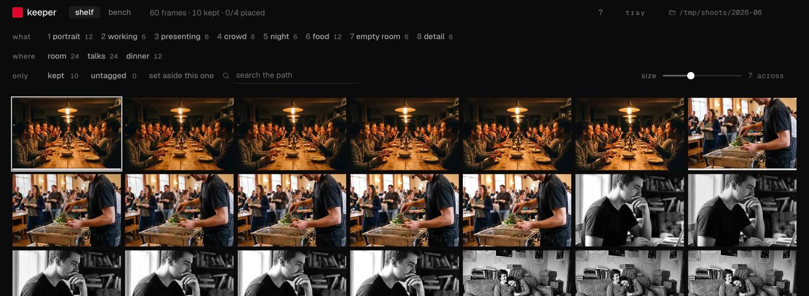
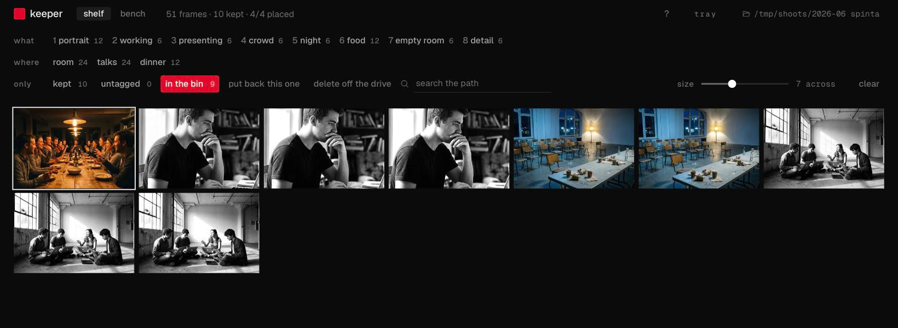
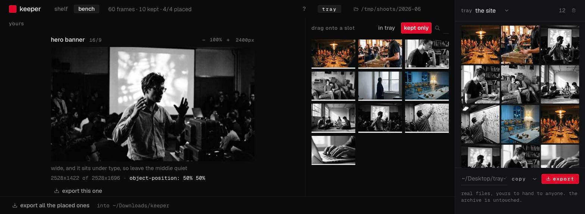

# keeper

keeper opens a folder of photographs and film and helps you pick the good ones
and cut them to the shapes a website or an instagram post needs. it runs on
your own computer. it does not need an account and it does not need the
internet.

a shoot comes back as 1,768 frames and a website has sixteen holes. every
hour between those two numbers goes on scrolling a finder window at 200px a
thumbnail, and that is the hour this takes back.

it was written against a photographer's archive and it is not only for
photographers. a pile of frames and a handful of holes to fill is the same job
whether the pile came off a camera, a phone, a drone or a screen recorder.



<sub>every frame in these shots is a generated stand in. real work does not go
in a readme.</sub>

## get it

everything is on the [releases page](https://github.com/gntrs/keeper/releases)
and there is nothing to install alongside it.

**on windows**, run the `.exe` setup and open keeper from the start menu.

**on a mac**, open terminal and paste these two lines. terminal is in
applications, utilities, or hold cmd, press space, and type its name.

```
curl -L -o ~/Downloads/keeper.tar.gz https://github.com/gntrs/keeper/releases/latest/download/keeper-macos-arm64.tar.gz
tar -xzf ~/Downloads/keeper.tar.gz -C /Applications
```

keeper is then in your applications folder and opens like anything else. the
first line fetches it and the second unpacks it, and you can throw the
download away afterwards. that is for an apple silicon mac, which is every mac
sold since late 2020. on an older intel mac, `arm64` becomes `x64` in the
first line.

there is a `.dmg` on that page as well and it holds exactly the same app. it
is the familiar way to install something on a mac and it is the one your mac
will argue with, which is why it is second here.

**your computer will warn you, and here is why.** letting a program pass
without a warning costs money every year, on each platform, and that money has
not been paid. so:

- **windows** says it protected your pc. press more info, then run anyway.
- **the mac dmg** says the developer cannot be verified. open system settings,
  go to privacy and security, scroll down, press open anyway. the two lines
  above do not hit this at all, and the difference is not a trick: a mac marks
  what a browser downloads and refuses to open it unchecked, and does not mark
  what you fetched yourself with a command you typed.

if you want to check what you downloaded before you unpack it, run
`shasum -a 256 ~/Downloads/keeper.tar.gz` and compare the answer against the
`.sha256` file next to the download on the releases page.

you should not take that on trust from a stranger. everything keeper is made
of is in this repository, the downloads are built by
[a script you can read](.github/workflows/release.yml), and every file has a
checksum next to it so you can prove the one you downloaded is the one that
was built.

## the first two minutes

1. **open keeper.** it opens in your web browser. that is just how the screen
   is drawn. nothing is on the internet and the page is coming from your own
   computer.
2. **drag a folder of photographs onto the page.** any folder. keeper opens
   the folder where it already is and does not copy or move anything.
3. **wait once.** keeper makes a small copy of each picture so the page can
   show hundreds at a time without crawling. a few thousand photographs takes
   a few minutes. it only ever happens once per folder.
4. **the shelf appears.** every photograph in the folder, on one screen, and
   eight cards walk you round it. they say what the keys do, they run once,
   and skipping them is fine.

next time you open keeper it opens the same folder again. the question mark in
the top corner holds every key and the settings, and the walkthrough is in
there if you want it a second time.

## picking the good ones

move with the **arrow keys**. press **k** to keep the one you are on. press
**space** to see it big.

that is the whole loop, and it is meant to be done with one hand without
looking down. a thousand photographs is about twenty minutes this way and an
afternoon with a mouse.

**delete does not delete.** press it and the photograph disappears from the
shelf and **the file does not move**. it goes to keeper's own bin, which is a
list, not a folder. you can put it back.



there is one button that really removes a file. it lives inside the bin, it
asks first, it tells you how many, and it uses your computer's own delete, so
the files land in the trash or the recycle bin and you can still get them
back from there.

this is the second version of that and the first one was wrong. delete used
to go straight to the trash. putting the fastest key in the app on the one
thing you cannot undo is how a tool eats somebody's photographs.

## cutting them to shape

instagram wants a tall picture. a youtube thumbnail wants a wide one. a
banner across the top of a website wants something wider still. the same
photograph does not survive all three, and you cannot tell which ones it
survives by looking at it.

so click a photograph and keeper shows it in **every shape at once**.



drag it into the shape you want, drag inside that box to move the picture,
hold **option** and scroll to zoom in. press export and the cut picture lands
in your downloads folder, in a folder called `keeper`. the original is not
touched.

the shapes are already there on the first run: instagram post, square, story
and reel, x, youtube thumbnail, link preview, pinterest, and a few sizes of
web banner. each one is the size that platform actually wants.

**if you zoom in too far, keeper tells you before you export.** past a certain
point there are not enough pixels left to fill the shape, so somebody else's
website would stretch it and it would look soft. keeper compares the two and
says so in red.

## piles

a pile is what you build while you browse. click photographs into it, keep
going, start another one when the subject changes, then export that pile as a
real folder of real files you can hand to anyone.

**exporting never moves your originals.** keeper reads from your folder and
writes somewhere else. your folder comes out of it byte for byte identical.

## letting an ai do the sorting

this one needs a little more from you, and it is optional. skip it if you do
not already use a coding assistant.

keeper has no ai in it and does not want your credit card for one. instead it
lays your photographs out as **contact sheets**, which are big grids of small
pictures, sized so a machine can still tell one face from another. you hand
those sheets to an assistant you already pay for, like claude or cursor,
along with the instructions in [AGENTS.md](AGENTS.md). it writes back a file
of tags. keeper reads that file and labels every photograph.

if the assistant miscounts a sheet, keeper **refuses that whole sheet**
rather than applying it. one bad count would silently shift every label after
it onto the wrong photograph, which would make the whole thing worthless.

## audio off a link

keeper opens a folder of photographs and film, and a piece of work often
needs a piece of music as well. the downloads tab takes a youtube or spotify
link and saves the audio as an mp3 into a folder you pick.

it is off until you turn it on, and turning it on is a card that says what
that costs before any of it happens: the internet, and two programs keeper
does not ship, [yt-dlp](https://github.com/yt-dlp/yt-dlp) and
[spotDL](https://github.com/spotDL/spotify-downloader). say yes and keeper
fetches those two from their own github releases, once on this machine, into
its own folder. say no and none of it happens and it does not ask again.

a spotify link is a name rather than a file. spotdl is the one thing here
that can turn that name into the track it stands for, and that is all it
does: the download itself is yt-dlp both times. it is the half that has to
stay current, so it is the half keeper keeps current.

one track a link. a playlist link gets the track it points at rather than the
playlist, so a link pasted out of habit cannot start two hundred downloads.

what you may do with what comes down is between you and whoever made it.
keeper does not check and does not know.

## is it safe

it is the first thing to check about anything you point at your photographs,
so it is written out rather than claimed in a badge.

**your photographs never leave your computer.** there is no upload, no
account, no login, no key, and no licence check. it works with the wifi
turned off. you can test that: turn the wifi off and use it.

**nothing is counted or reported.** no analytics, no crash reports, no usage
tracking. not turned off by default, not in there at all.

**two things can reach the internet and both ask you first.** keeper can check
whether a newer keeper exists: a card asks you once, in words, and saying no
means it never asks again and never makes the request. saying yes fetches one
small file that carries no name, no photographs, and nothing about you. and
the downloads tab, which is off until you turn it on, and which is the only
part of keeper that fetches something that is not keeper.

**neither of those sends anything about you.** not a photograph, not a file
name, not a folder name, not a count of anything. the wifi test above still
holds for everything else in here: turn it off and the shelf, the bench, the
tags, the crops and the exports all still work.

**your photographs are read and never written to.** keeper makes one folder
inside yours, called `.keeper`, and puts its small copies, your labels and
your crops in there. delete that folder and your archive is exactly as it was.

**nothing is generated.** no ai model runs here and no picture of yours is
sent anywhere to be looked at by one.

## what is coming

keeper is a side project. this is what it is pointed at, not a schedule, and
it is written down so you can tell whether the thing you need is on the list
or not on it at all.

- **film treated the way the photographs are.** keeper reads mov, mp4, mkv and
  the rest today, and shows you a poster frame off each one. the bench crops
  stills and nothing else. cutting a clip to a shape, and trimming it, at the
  speed the shelf already runs at.
- **more inside the crop.** the bench gives a slot one crop and stops there.
- **a size for youtube**, thumbnail with it.
- **an export that goes where it is going**, instead of landing in a folder
  you then have to open somewhere else to post it.
- **tagging without an assistant.** the contact sheets go to one you already
  pay for today. a model small enough to run on your own machine doing the
  same job would take away the last thing keeper asks you to bring. it ships
  only if that can be done locally, for free, and well enough to trust.

none of that is promised for a date. it gets built when it gets built.

## if something is wrong

keeper can check itself over and tell you what is missing.

**on windows** there is a **keeper doctor** shortcut in the start menu, next
to keeper itself. **on a mac** it needs a terminal: `keeper doctor`.

either way it answers in plain sentences rather than error codes, and that is
the thing to copy and send on when you ask anyone for help.

on windows, keeper cannot read raw camera files on its own, because windows
does not come with anything that reads them. install
[ffmpeg](https://ffmpeg.org) and it will read most of them. jpg, png, heic and
the rest work either way. macs read everything already.

## for people who use a terminal

everything above works without one. this part is for people who want it.

```
npm install
node bin/keeper.mjs ~/Archive
```

```
keeper <folder>                 scan, thumbnail, and open the shelf
keeper app [folder]             the way the icon opens it: remembers the last
                                archive, takes its own port, and reuses the
                                copy that is already running
keeper sheets <folder>          contact sheets for a coding agent to read
keeper tag <folder> <file>      apply the tags that agent wrote
keeper export <folder>          write the placed crops out
keeper trays <folder>           what is in the trays, and how much
keeper init [folder]            create keeper.config.json
keeper doctor                   what this machine can and cannot do
```

`--port` defaults to 7777, `--cols` and `--rows` set the contact sheet grid at
6 by 4, `--rescan` rebuilds an index that already exists, and `--no-open`
leaves the browser alone. typed bare, with no folder after it, `keeper`
prints this list: a terminal opens in your home folder, and thumbnailing
every file you own is not what someone asking what the command does had in
mind.

### the keyboard

| | |
|---|---|
| arrows | move the cursor, and **a letter tags** whatever it is on |
| `k` | keeps the frame |
| `space` | quick look, the way it works everywhere else on this machine |
| click | picks, `shift`+click a range, `cmd`+click one, `cmd`+drag a box |
| `cmd`+`a` | everything the filters left, and not one frame more |
| a letter, with frames picked | **tags all of them at once**, and moves nothing |
| `cmd`+`return` | sends the picked frames to the tray |
| `option`+`r` | reveals the original in finder, selected |
| `cmd`+`f` | finds, `option`+`o` opens another folder, `option`+`1` and `option`+`2` change view |
| `delete` | sets the frame aside in keeper's bin, nothing on the drive moves |

the modifier is option and not cmd on three of those because chrome resolves
`cmd`+`r`, `cmd`+`o` and `cmd`+`1` above the page: `preventDefault` runs and
the tab reloads anyway. the physical key is read off `e.code` rather than
`e.key`, because option on a mac rewrites the character and `option`+`r`
arrives as `®`.

### your own shapes

the built in formats live in [`src/formats.mjs`](src/formats.mjs). your own go
in `keeper.config.json`:

```json
{
  "slots": [
    { "id": "hero",    "aspect": "16/9", "width": 2400 },
    { "id": "about-1", "aspect": "3/2",  "width": 1200,
      "note": "the room rather than a wall of faces" }
  ]
}
```

the config is read from the folder you run keeper in, not from the archive,
because the holes belong to the project and the photographs do not. `keeper
init` writes the example there for you. a slot of yours with the same id as a
built in one replaces it quietly, and `"formats": false` turns the whole
standard set off.

if you have not zoomed in and you have a config, the bench also prints the
exact `object-position` line for your stylesheet, so the original ships uncut
and the browser does the cropping.

### exporting a tray three ways

```
keeper trays ~/Archive
keeper trays ~/Archive --export tray-1 --to ~/Desktop/for-the-site
keeper trays ~/Archive --export tray-1 --to ~/Desktop/live --mode symlink
```

**copies** are real files, yours to hand to anyone. **symlinks** and **finder
aliases** copy nothing and point at the originals, the first breaking if you
move them and the second following them. the terminal names the mode it just
ran every time, because a folder of links and a folder of copies look
identical in a listing and weigh nothing alike.

keeper refuses to export into a folder inside the archive. it would work
once. the next scan would find the copies, give them their own ids,
thumbnail them, and you would be browsing every exported frame twice with the
tags on only one of the pair.

## how it works, for anyone reading the source

**the server binds to `127.0.0.1`.** not `0.0.0.0`, which means it cannot be
reached from the other laptop on your own wifi, never mind from outside. one
browser, one machine. every `fetch` in the source names either a path on this
machine or github, and `grep -rn "fetch(" src web bin` is the whole audit.

**a placement is stored in the negative's own coordinates, not the screen's.**
three numbers: where the centre of the crop sits in the source, and how wide
it is as a fraction of the source. the height falls out of the slot's aspect
at the moment of painting. that is what lets a layout change a frame's aspect
at a breakpoint without silently meaning something different. a placement
written in screen pixels would.

**a frame's id is a hash of its path, not its position.** drop 200 new
photographs into the archive and every tag written last month still points at
the same picture. position based ids would have slid by 200 and repointed the
lot, quietly. it is also why a frame you take back out of the bin comes back
to its own tags.

**a browser is never told where a dropped folder lives.** it gets the name,
and for a folder it may list what sits directly inside, and that is the end of
it. so keeper recovers the path three ways: the drag's own `file://` url when
the source writes one, the machine's search index, and a read of the handful
of folders an archive is ever kept in. if all three come up empty the real
folder dialog opens, which is the only thing on the machine that can hand a
browser a path and mean it. nothing in it ever says the drop failed when what
happened is that the browser withheld the path.

**the two machines differ in five places and only five:** the file manager,
the wastebasket, the shortcut a tray exports as, the search index, and the
list of folders to look in. those live in `src/os/` and everything above them
is one codebase.

reads jpg, png, webp, avif, tif, heic and dng, and mov, mp4, m4v, mkv, avi,
webm and mts. raw files come in through their embedded preview, which is all a
contact sheet needs. clips need `ffmpeg` on the path, and their poster frame
is cut from a third of the way in, because frame one is a lens cap or a whip
pan often enough that it is not worth trusting.

## updating

keeper can update itself, and it asks before it ever looks. what comes down
is about a quarter of a megabyte, because it is keeper and not the runtime
under it. it is checked against the checksum the release published before a
file moves, the copy being replaced is set aside rather than deleted so a
failure puts it back, and a release that changes what keeper depends on
cannot be installed this way, says so, and sends you to the downloads
instead of installing half of something.

## where things live

everything keeper writes goes in `<archive>/.keeper/`: the index, the small
copies, the contact sheets, your tags, your placements and your trays. delete
that folder and the archive is exactly as it was.

opened from its icon it keeps a little more, and this is all of it: which
archive was open last, which port it is on, and what you have answered about
updates and about downloads. `~/Library/Application Support/keeper` on macos,
`%LOCALAPPDATA%\keeper` on windows. if you turned downloads on, yt-dlp and
spotdl sit in a `bin` folder beside those, which is also why an update to
keeper never has to fetch them again. deleting the lot loses the memory of
where you were, and means those two are fetched again next time you ask for
them.

## the look

a red square and the word `keeper` beside it, and a photograph is the only
thing on the screen worth looking at.

one accent, `#e1062c`, over `#131315` raised and `#0b0b0c` ground. it means
one of exactly two things anywhere it appears: you chose this, or you have to
deal with this. a tab you are already looking at is neither, and neither is a
photograph.

type is geist and geist mono, self hosted in `web/font`, ofl, nothing fetched
at runtime. the mono carries the wordmark, the nav, every label, every chip
and every number, and the sans is left to do the one thing a mono cannot,
which is read as a sentence.

## licence

source available, not open source. free while keeper is in testing, and it is
in testing now: use it for anything, at home or at work, on as many machines
as you like, no payment, no account, no key and no licence check.
[`LICENSE`](LICENSE) says it in words rather than in a badge.

what you cannot do is sell it, redistribute it, or run it as a service. later
versions may be sold under a one time licence, and every version published
while keeper is in testing stays free under this licence forever, so a copy
you already have never stops working and never has to be paid for.

it was mit, then apache 2.0 while there was nothing to sell. those releases
are still apache and that cannot be taken back. a dmg is not source: it
carries node, sharp and libvips, and libvips is lgpl, so shipping that binary
means saying whose work is inside it and letting somebody swap it.
[`NOTICE`](NOTICE) does both and names the file, and nothing in keeper's own
licence takes away anything those licences give you.
